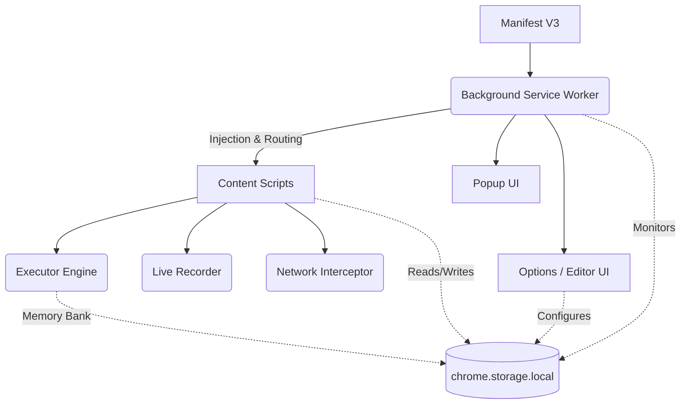

<div align="center">

# 🚀 TaskOrbit

**Your personal robotic process automation assistant built right into your browser.**  
Automate repetitive tasks, fill forms, scrape & inject data, and streamline workflows without writing a single line of code.

[](#)
[](#)
[](https://opensource.org/licenses/MIT)
[](#)

</div>

---

## ❓ Why TaskOrbit?

Tired of performing the same 10 clicks every morning? Exhausted by manual data entry across legacy enterprise systems? **TaskOrbit** solves the pain of repetitive web operations by turning your browser into a smart, automated assistant. 

Unlike heavy desktop RPA tools or expensive cloud solutions, TaskOrbit runs entirely locally within your browser. It's fast, secure, and specifically designed for non-technical users to build robust web automations through simple recording and visual editing.

---

## ✨ Key Features

- **🔴 Live Workflow Recording:** Build automations simply by performing the actions yourself. TaskOrbit records your clicks, keystrokes, and selections in real-time.
- **⚡ Auto-Run System:** Configure workflows to execute automatically the moment you land on specific websites (Pro).
- **🧩 Intuitive Visual Editor:** A sleek, drag-and-drop interface for fine-tuning workflows, adding delays, and configuring custom logic.
- **✏️ Inline JSON Editor:** Power users can toggle a raw JSON view to directly edit the entire workflow data structure, with live validation and instant visual sync.
- **🔀 Advanced Branching Logic:** If/Else conditions based on element existence or variable comparisons with full operator support (`==`, `!=`, `>`, `<`, `contains`, `starts with`, `regex`, etc.) (Pro).
- **🔁 Loop Container:** Iterate over page elements, data rows, or a fixed count, with nested step support and drag-and-drop reordering (Pro).
- **📊 CSV Data Processing:** Load CSV data (paste or URL), iterate rows with `For Each Data Row`, inject column values as `{{variables}}`, scrape data into table rows, and export results as CSV files (Pro).
- **🧠 Smart Deduplication (Memory Bank):** Prevents duplicate scraping and duplicate data injection via SHA-256 row hashing and unique-key tracking, persisted across sessions in `chrome.storage.local` (Pro).
- **💎 Lite vs Pro Tier System:** Enforces strict limits for Free (Lite) users while unlocking advanced logic via cryptographically signed license keys.
- **🔒 Privacy-First Architecture:** 100% local execution. Your data and workflows never leave your machine.
- **📦 Import & Export:** Share your automations with colleagues or back them up effortlessly via JSON.
- **📂 Workflow Folders:** Organize workflows into collapsible folders for easy management.
- **⌨️ Keyboard Shortcuts:** Assign custom keyboard shortcuts to trigger any workflow instantly.
- **🔑 Password Reveal:** Auto-reveal password fields on all sites or specific domains, plus a right-click context menu option.
- **📋 Execution Logs:** Full history of workflow runs with timestamps, durations, and status messages.
- **⏱️ Smart Scheduling:** Run background tasks automatically on a recurring schedule (Pro).
- **🌐 Send Webhook:** POST workflow variable data to external URLs with optional auth headers (Pro).
- **🔗 Nested Workflows:** Call one workflow from inside another for modular, reusable automation (Pro).
- **🐛 Step-by-Step Debugger:** Interactive debugging that pauses between steps, highlights target elements on the page, and shows a live variable inspector.
- **🗂️ Workflow Templates Gallery:** A repository of 12 pre-built templates across Productivity, Data Entry, Scraping, Utility, and QA/Testing categories.

---

## 📸 Screenshots

> *Screenshots coming soon...*
> 
> * [Placeholder: Workflow Visual Editor]
> * [Placeholder: Live Recording Overlay]
> * [Placeholder: Execution Progress Toast]

---

## 🛠️ Installation

Currently, TaskOrbit is available for developers. To load it into Chrome:

1. Download or clone this repository to your local machine.
2. Open your Chromium-based browser (Chrome, Edge, Brave) and navigate to `chrome://extensions/`.
3. Enable **Developer mode** using the toggle in the top-right corner.
4. Click **Load unpacked** and select the `TaskOrbit` folder (where the `manifest.json` is located).
5. 📌 **Tip:** Pin the TaskOrbit extension icon to your browser toolbar for quick access!

---

## 🚀 Quick Start

Creating your first automation is incredibly simple. Let's create a workflow that automatically clicks a "Refresh Data" button when you visit your dashboard:

1. Click the **TaskOrbit** icon in your toolbar and select **+ New**.
2. Name your workflow: `Daily Dashboard Refresh`.
3. In the popup, click the **🔴 Record** button.
4. Navigate to your dashboard and click the specific button you want to automate.
5. Open the extension popup again and click **🛑 Stop & Save**.
6. Whenever you want to run this sequence, just click **Run**!

---

## 🏗️ Workflow Builder

TaskOrbit provides three ways to create and maintain your automations:

### 1. Live Recording
The easiest way to get started. When recording is active, TaskOrbit injects a lightweight script into the page that captures your natural interactions (clicks, keyboard input, dropdown selections). Once saved, these actions are converted into editable steps.

### 2. Visual Editor
Open the full Options page to access the visual builder. Here you can:
- Add advanced steps from organized category groups (Interaction, Wait & Flow, Data & Variables, Browser, Logic & Loops).
- Re-order steps via drag-and-drop.
- Modify element selectors for better reliability.
- Set up conditional logic (If/Else blocks) and loop containers.
- Configure CSV data loading and data row iteration.

### 3. Inline JSON Editor
For power users, toggle the **Edit JSON** button at the bottom of any workflow to switch to a raw JSON textarea. You can:
- Mass find-and-replace selectors or variable names across all steps.
- Copy/paste entire workflow structures from templates.
- Directly manipulate nested loop and condition blocks.
- Click **Apply JSON** to validate and instantly sync changes back to the visual builder.

---

## 🎯 Element Selection Strategies

When finding elements on a page, TaskOrbit supports multiple intelligent fallback strategies to ensure your workflow remains robust even if the website changes slightly.

| Strategy | Ideal Use Case | Resolution Method |
| :--- | :--- | :--- |
| **`CSS selector`** | Standard web pages with predictable classes (`.btn-primary`) or attributes (`[data-test-id="submit"]`). | `document.querySelector` |
| **`Element ID`** | Highly reliable when developers use unique IDs. Enter the exact ID (no `#`). | `document.getElementById` |
| **`Name attribute`** | Forms and input fields where `name="..."` is consistently used. | `document.getElementsByName` |
| **`XPath`** | Complex DOM traversals where CSS selectors fall short (e.g., `//button[contains(text(), 'Submit')]`). | `document.evaluate` |
| **`Visible text`** | The most human-readable approach. Matches the exact visible text on the button or link. | Deep text match algorithm |

---

## 📚 Workflow Step Types

Our comprehensive step library is organized into logical groups for easy discovery.

### 🖱️ Interaction
| Step Type | Description |
| :--- | :--- |
| **Click element** | Waits for the element, scrolls it into view, and simulates a natural user click. |
| **Focus element** | Sets focus on the target element. |
| **Type text** | Sets field values and fires `input`/`change` events for realistic simulation. |
| **Clear field** | Empties an input or textarea instantly. |
| **Select option** | Interacts with `<select>` dropdowns by matching value or visible text. |
| **Check / uncheck** | Enforces the precise state of checkboxes and radio buttons. |
| **Press Key** | Simulates exact keystrokes, including modifiers (Ctrl/Cmd, Shift) and special keys (Enter, Esc). |

### ⏱️ Wait & Flow
| Step Type | Description |
| :--- | :--- |
| **Wait for element** | Pauses execution until an element exists in the DOM. |
| **Wait visible** | Polls until an element is fully visible and interactable. |
| **Wait invisible** | Polls until an element disappears or becomes hidden. |
| **Wait (delay)** | A hard pause for a specified number of milliseconds. |
| **Wait for Network Idle** | Pauses until all background XHR/fetch requests have settled. Perfect for SPAs! |
| **Run Workflow (Nested)** 🔒 | Execute another workflow by ID, enabling modular, reusable automation design. |
| **Send Webhook** 🔒 | POST current variable state to an external URL with optional authorization headers. |

### 📊 Data & Variables
| Step Type | Description |
| :--- | :--- |
| **Extract Text** 🔒 | Extracts the visible text or attribute value from an element and saves it to a variable. |
| **Calculate Math** 🔒 | Evaluates a math expression using variables (e.g., `{{price}} * {{quantity}}`) and stores the result. |
| **Export Variables** 🔒 | Exports all current workflow variables to a downloadable CSV or JSON file. |
| **Load CSV Data** 🔒 | Loads CSV data from pasted text or a remote URL into memory for row iteration. |
| **Save Variables to Table Row** 🔒 | Appends current variable state as a new row to an in-memory data table, with optional **Unique Key** deduplication. |
| **Export Table as CSV** 🔒 | Downloads the accumulated data table as a properly formatted CSV file. |
| **Mark Row as Processed** 🔒 | Hashes the current data row (SHA-256) and saves it to the workflow's Memory Bank, enabling smart skip-on-rerun. |

### 🌐 Browser
| Step Type | Description |
| :--- | :--- |
| **Navigate to URL** | Navigates the current tab to a specified URL. Supports variable interpolation. |
| **Take Screenshot** | Captures a screenshot of the visible tab area and downloads it as a PNG. |

### 🧠 Logic & Loops
| Step Type | Description |
| :--- | :--- |
| **If Element Exists** 🔒 | Conditional branch: executes child steps only if the target element is present in the DOM. |
| **If Element Does Not Exist** 🔒 | Conditional branch: executes child steps only if the target element is absent. |
| **If Variable** 🔒 | Conditional branch: compares a variable against a value using operators (`==`, `!=`, `>`, `<`, `>=`, `<=`, `contains`, `starts with`, `!contains`, `regex`). |
| **Else** 🔒 | Defines the alternate branch for a preceding If block. |
| **End If** 🔒 | Marks the end of an If/Else conditional block. |
| **Loop Container** 🔒 | Iterates child steps via three modes: **Count** (fixed N), **forEach** (over matching page elements), or **forEachRow** (over loaded CSV data rows with automatic deduplication). |

> 🔒 = Requires TaskOrbit Pro

---

## 🧠 Smart Data Deduplication (Memory Bank)

TaskOrbit includes a built-in **Memory Bank** system that prevents duplicate data processing across workflow runs.

### How It Works

- **For Scraping (`Save Variables to Table Row`):** Set a **Unique Key** field (e.g., `{{url}}` or `{{product_id}}`). The engine checks the workflow's Memory Bank before appending — if that key was already scraped, the row is silently skipped.
- **For Data Injection (`For Each Data Row`):** The engine automatically hashes each row's content (SHA-256) and checks against the Memory Bank. Previously processed rows are skipped instantly.
- **Manual Marking (`Mark Row as Processed`):** Place this step at the end of a loop body. It hashes the current row and saves it. If a workflow crashes mid-run, simply re-run it — already-processed rows are skipped automatically.
- **Reset:** Click the red **Clear Memory Bank** button at the bottom of the workflow editor to wipe all remembered hashes and unique keys for that workflow.

All memory data is stored locally in `chrome.storage.local`, keyed per workflow ID.

---

## 🤖 Auto-Run System

TaskOrbit can operate autonomously without user intervention. By configuring the **Auto-run** system, workflows execute instantly when you visit specific websites.

**How it works:**
1. Define a URL pattern (e.g., `https://my-internal-erp.com/login/*`).
2. Toggle the **Auto-run** switch in the workflow settings.
3. **Grant Access:** Because TaskOrbit respects your privacy, it utilizes a least-privilege permission model. You must explicitly grant the extension permission to run on those specific domains.

---

## 🛡️ Privacy & Security

In an era of cloud-connected tools, TaskOrbit takes a radical approach: **Absolute Local Isolation**.

> [!IMPORTANT]
> **Your data is yours.**
> - ❌ **No Cloud Service:** We do not host, store, or process your workflows on external servers.
> - ❌ **No Telemetry:** We do not track your usage, clicks, or visited sites.
> - ❌ **No External APIs:** The core extension operates entirely offline once installed.
> - ✅ **Local-Only Storage:** All configurations, variables, workflows, and Memory Bank data are securely stored via `chrome.storage.local`.

---

## 💼 Example Use Cases

TaskOrbit is incredibly versatile and shines in environments with repetitive, structured processes:

*   **🏢 Government & Administration:** Streamlining repetitive data entry in state portals, Panchayat administration tasks, and civic form filling.
*   **📊 Enterprise ERP Systems:** Automating weekly report generation and data syncing between legacy web portals.
*   **✍️ Mass Data Entry:** Loading a CSV of contacts and auto-filling web forms for each row, skipping any already submitted.
*   **🕷️ Web Scraping:** Extracting product data, prices, or listings into structured CSV exports with automatic deduplication.
*   **🛒 E-Commerce Management:** Quickly updating inventory or product statuses across seller dashboards.
*   **🛠️ Developer & QA Operations:** Automating browser test scenarios, clearing specific caches, or setting up local dev environments instantly.

---

## 🏛️ Project Architecture



---

## 📁 Project Structure

```text
TaskOrbit/
├── manifest.json               # Extension manifest (Manifest V3)
├── background.js               # Service worker: routing, scheduling, alarms, license checks
├── sandbox.html / sandbox.js   # Sandboxed math expression evaluator
├── shared/
│   ├── storage.js              # Data model, STEP_TYPES, CRUD helpers
│   ├── capabilities.js         # Feature flags & tier logic (Lite/Pro)
│   └── license.js              # License validation, JWT verification, offline caching
├── content/
│   ├── executor.js             # Core workflow execution engine
│   ├── recorder.js             # Live action recording
│   ├── toast.js                # Execution progress overlay
│   ├── interceptor.js          # Network request monitoring
│   └── autoReveal.js           # Password reveal injection
├── popup/
│   ├── popup.html / popup.js   # Browser toolbar popup UI
│   └── popup.css
├── options/
│   ├── options.html            # Full workflow editor page
│   ├── options.js              # Visual builder, JSON editor, settings, logs
│   └── options.css
├── backend/                    # Licensing API server (Express + SQLite3 + JWT)
└── docs/
    └── LITE_VS_PRO_PLAN.md     # Tier strategy & architecture document
```

---

## 🖥️ Licensing Backend & Control Center

TaskOrbit features a secure, containerized licensing backend designed to run on Docker environments:
* **Express API Server:** Handles CORS requests from chrome extensions (`chrome-extension://*`), request rate-limiting, and signed JWT issuance (valid for up to 30 days) with a 7-day offline grace period.
* **SQLite3 Database:** Stores active, revoked, and expired license keys linked to optional client emails and names. Each key is bound 1:1 to an email/device ID.
* **Admin Control Center:** A premium dark-themed dashboard served at `/admin` that requires your `ADMIN_SECRET` access key (saved in `sessionStorage`). It allows live generation, filtering/searching by user details, key clipboard copies, and key revocation.
* **Docker Orchestration:** Simple multi-stage `Dockerfile` and `docker-compose.yml` with host volume mounting for database persistence.

---

## ⚠️ Limitations

While powerful, TaskOrbit operates within the boundaries of modern browser security constraints:

- **Brittle Selectors:** Websites that frequently change their DOM structure may break recorded selectors. It's recommended to manually assign stable CSS classes or IDs if available.
- **Single Page Applications (SPAs):** Heavy asynchronous apps might require explicit `wait for network idle` or `wait for element` steps.
- **Iframes:** Interacting inside cross-origin iframes is currently not supported due to browser security policies.
- **Restricted Pages:** Chrome extensions cannot execute on `chrome://` pages or the Chrome Web Store itself.

---

## 🗺️ Roadmap

We are constantly working to improve TaskOrbit. Here's what is currently planned:

### ✅ Completed Features
- [x] **Variables:** Advanced workflow-level variable definitions with `{{varName}}` interpolation.
- [x] **Conditional Logic:** Native If/Else branching based on element existence or variable comparisons.
- [x] **Advanced Branching:** Full operator support (`==`, `!=`, `>`, `<`, `>=`, `<=`, `contains`, `starts with`, `!contains`, `regex`).
- [x] **Loops:** Count-based, element-based (`forEach`), and data-row-based (`forEachRow`) iteration.
- [x] **CSV Data Processing:** Load CSV, iterate rows, inject data, scrape to table, export as CSV.
- [x] **Smart Deduplication:** Memory Bank with SHA-256 hashing for both scraping and data injection.
- [x] **Inline JSON Editor:** Raw JSON editing with live validation and visual sync.
- [x] **Grouped Step Types:** Steps organized into logical `<optgroup>` categories in the dropdown.
- [x] **Licensing Backend:** Node.js, SQLite3, and JWT validation server.
- [x] **Admin Dashboard:** Secure single-page control center for managing keys.
- [x] **Workflow Folders:** Collapsible folder organization in the sidebar.
- [x] **Keyboard Shortcuts:** Custom shortcut recording and binding per workflow.
- [x] **Execution Logs:** Timestamped run history with status and error details.
- [x] **Import/Export:** Full JSON import/export of individual or all workflows.
- [x] **Password Reveal:** Global, per-site, or right-click context menu password revealing.
- [x] **Nested Workflows:** Run one workflow from inside another.
- [x] **Send Webhook:** POST variable data to external endpoints.
- [x] **Workflow Templates Gallery:** Pre-built configurations for popular platform flows.
- [x] **Step-by-Step Debugger:** Interactive debugger with selector highlighting and live variable inspector.

### 🔜 Planned Features
- [ ] **Cron Scheduling:** Advanced cron expression scheduling (replace basic interval logic).
- [ ] **Marketplace:** A community hub to share and discover workflows.
- [ ] **AI-assisted Selector Recovery:** Self-healing workflows when website layouts change.
- [ ] **Workflow Analytics:** Track time saved and execution success rates.
- [ ] **Cloud Sync (Optional):** Opt-in syncing across your devices.

---

## 🤝 Contributing

We welcome contributions from the open-source community! Whether you're fixing bugs, improving documentation, or proposing new features:

1. Fork the repository.
2. Create a new branch for your feature (`git checkout -b feature/AmazingFeature`).
3. Commit your changes (`git commit -m 'Add some AmazingFeature'`).
4. Push to the branch (`git push origin feature/AmazingFeature`).
5. Open a Pull Request.

Please ensure your code adheres to the existing style and architectural patterns.

---

## 📄 License

This project is licensed under the [MIT License](https://opensource.org/licenses/MIT).
