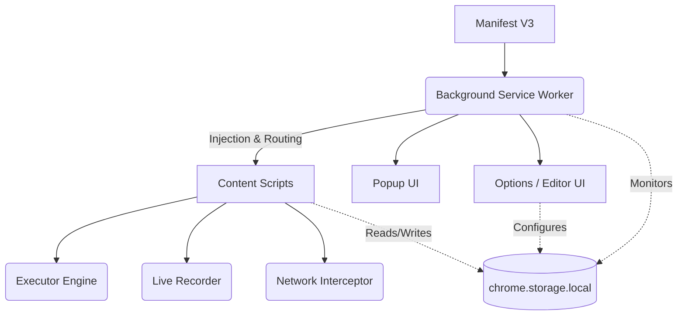

# 🚀 TaskOrbit

**Your personal robotic process automation assistant built right into your browser.**  
Automate repetitive tasks, fill forms, extract data, and streamline workflows without writing a single line of code.

---

## ❓ Why TaskOrbit?

Tired of performing the same 10 clicks every morning? Exhausted by manual data entry across legacy enterprise systems? **TaskOrbit** solves the pain of repetitive web operations by turning your browser into a smart, automated assistant. 

Unlike heavy desktop RPA tools or expensive cloud solutions, TaskOrbit runs entirely locally within your browser. It's fast, secure, and specifically designed for non-technical users to build robust web automations through simple recording and visual editing.

---

## ✨ Key Features

- **🔴 Live Workflow Recording:** Build automations simply by performing the actions yourself. TaskOrbit records your clicks, keystrokes, and selections in real-time.
- **⚡ Auto-Run System:** Configure workflows to execute automatically the moment you land on specific websites.
- **🧩 Intuitive Visual Editor:** A sleek, drag-and-drop interface for fine-tuning workflows, adding delays, and configuring custom logic.
- **🔒 Privacy-First Architecture:** 100% local execution. Your data and workflows never leave your machine.
- **📦 Import & Export:** Share your automations with colleagues or back them up effortlessly via JSON.
- **🗃️ Robust Data Extraction:** Scrape text, calculate math dynamically, and export variables directly to CSV or JSON.
- **⏱️ Smart Scheduling:** Run background tasks automatically on a recurring schedule.

---

## 📸 Screenshots

> *Screenshots coming soon...*
> 
> * [Placeholder: Workflow Visual Editor]
> * [Placeholder: Live Recording Overlay]
> * [Placeholder: Execution Progress Toast]

---

## 🛠️ Installation

Currently, TaskOrbit is available for developers. To load it into Chrome:

1. Download or clone this repository to your local machine.
2. Open your Chromium-based browser (Chrome, Edge, Brave) and navigate to `chrome://extensions/`.
3. Enable **Developer mode** using the toggle in the top-right corner.
4. Click **Load unpacked** and select the `TaskOrbit` folder (where the `manifest.json` is located).
5. 📌 **Tip:** Pin the TaskOrbit extension icon to your browser toolbar for quick access!

---

## 🚀 Quick Start

Creating your first automation is incredibly simple. Let's create a workflow that automatically clicks a "Refresh Data" button when you visit your dashboard:

1. Click the **TaskOrbit** icon in your toolbar and select **+ New**.
2. Name your workflow: `Daily Dashboard Refresh`.
3. In the popup, click the **🔴 Record** button.
4. Navigate to your dashboard and click the specific button you want to automate.
5. Open the extension popup again and click **🛑 Stop & Save**.
6. Whenever you want to run this sequence, just click **Run**!

---

## 🏗️ Workflow Builder

TaskOrbit provides two primary ways to create and maintain your automations:

### 1. Live Recording
The easiest way to get started. When recording is active, TaskOrbit injects a lightweight script into the page that captures your natural interactions (clicks, keyboard input, dropdown selections). Once saved, these actions are converted into editable steps.

### 2. Manual Editing
Open the full Options page to access the visual builder. Here you can:
- Add advanced steps like *Wait for Network Idle* or *Extract Text*.
- Re-order steps via drag-and-drop.
- Modify element selectors for better reliability.
- Set up conditional logic (If/Else blocks).

---

## 🎯 Element Selection Strategies

When finding elements on a page, TaskOrbit supports multiple intelligent fallback strategies to ensure your workflow remains robust even if the website changes slightly.

| Strategy | Ideal Use Case | Resolution Method |
| :--- | :--- | :--- |
| **`CSS selector`** | Standard web pages with predictable classes (`.btn-primary`) or attributes (`[data-test-id="submit"]`). | `document.querySelector` |
| **`Element ID`** | Highly reliable when developers use unique IDs. Enter the exact ID (no `#`). | `document.getElementById` |
| **`Name attribute`** | Forms and input fields where `name="..."` is consistently used. | `document.getElementsByName` |
| **`XPath`** | Complex DOM traversals where CSS selectors fall short (e.g., `//button[contains(text(), 'Submit')]`). | `document.evaluate` |
| **`Visible text`** | The most human-readable approach. Matches the exact visible text on the button or link. | Deep text match algorithm |

---

## 📚 Workflow Step Types

Our comprehensive step library allows you to interact with almost any web application element.

### 🖱️ Interaction & Input
| Step Type | Description |
| :--- | :--- |
| **Click element** | Waits for the element, scrolls it into view, and simulates a natural user click. |
| **Type text** | Sets field values and fires `input`/`change` events for realistic simulation. |
| **Set text** | Instantly overrides the `.value` property (useful for hidden/stubborn inputs). |
| **Clear field** | Empties an input or textarea instantly. |
| **Select option** | Interacts with `<select>` dropdowns by matching value or visible text. |
| **Check / uncheck** | Enforces the precise state of checkboxes and radio buttons. |
| **Press key** | Simulates exact keystrokes, including modifiers (Ctrl/Cmd, Shift) and special keys (Enter, Esc). |

### ⏱️ Timing & Synchronization
| Step Type | Description |
| :--- | :--- |
| **Wait for element** | Pauses execution until an element exists in the DOM. |
| **Wait visible** | Polls until an element is fully visible and interactable. |
| **Wait (delay)** | A hard pause for a specified number of milliseconds. |
| **Wait for network idle**| Pauses until all background XHR/fetch requests have settled. Perfect for SPAs! |

*(For advanced extraction, calculation, and conditional steps, see the full documentation in the extension).*

---

## 🤖 Auto-Run System

TaskOrbit can operate autonomously without user intervention. By configuring the **Auto-run** system, workflows execute instantly when you visit specific websites.

**How it works:**
1. Define a URL pattern (e.g., `https://my-internal-erp.com/login/*`).
2. Toggle the **Auto-run** switch in the workflow settings.
3. **Grant Access:** Because TaskOrbit respects your privacy, it utilizes a least-privilege permission model. You must explicitly grant the extension permission to run on those specific domains.

---

## 🛡️ Privacy & Security

In an era of cloud-connected tools, TaskOrbit takes a radical approach: **Absolute Local Isolation**.

> [!IMPORTANT]
> **Your data is yours.**
> - ❌ **No Cloud Service:** We do not host, store, or process your workflows on external servers.
> - ❌ **No Telemetry:** We do not track your usage, clicks, or visited sites.
> - ❌ **No External APIs:** The core extension operates entirely offline once installed.
> - ✅ **Local-Only Storage:** All configurations, variables, and workflows are securely stored via `chrome.storage.local`.

---

## 💼 Example Use Cases

TaskOrbit is incredibly versatile and shines in environments with repetitive, structured processes:

*   **🏢 Government & Administration:** Streamlining repetitive data entry in state portals, Panchayat administration tasks, and civic form filling.
*   **📊 Enterprise ERP Systems:** Automating weekly report generation and data syncing between legacy web portals.
*   **✍️ Mass Data Entry:** Migrating spreadsheet data into web-based CRMs or databases rapidly.
*   **🛒 E-Commerce Management:** Quickly updating inventory or product statuses across seller dashboards.
*   **🛠️ Developer & QA Operations:** Automating browser test scenarios, clearing specific caches, or setting up local dev environments instantly.

---

## 🏛️ Project Architecture

---

## ⚠️ Limitations

While powerful, TaskOrbit operates within the boundaries of modern browser security constraints:

- **Brittle Selectors:** Websites that frequently change their DOM structure may break recorded selectors. It's recommended to manually assign stable CSS classes or IDs if available.
- **Single Page Applications (SPAs):** Heavy asynchronous apps might require explicit `wait for network idle` or `wait for element` steps.
- **Iframes:** Interacting inside cross-origin iframes is currently not supported due to browser security policies.
- **Restricted Pages:** Chrome extensions cannot execute on `chrome://` pages or the Chrome Web Store itself.

---

## 🗺️ Roadmap

We are constantly working to improve TaskOrbit. Here's what is currently planned:

### 🔜 Planned Features
- [ ] **Variables:** Advanced workflow-level variable definitions.
- [ ] **Conditional Logic:** Native If/Else branching based on page state.
- [ ] **Loops:** Iterate over lists or tables dynamically.
- [ ] **Workflow Templates:** Pre-built configurations for popular platforms.
- [ ] **Marketplace:** A community hub to share and discover workflows.
- [ ] **AI-assisted Selector Recovery:** Self-healing workflows when website layouts change.
- [ ] **Workflow Analytics:** Track time saved and execution success rates.
- [ ] **Cloud Sync (Optional):** Opt-in syncing across your devices.

---

## 🤝 Contributing

We welcome contributions from the open-source community! Whether you're fixing bugs, improving documentation, or proposing new features:

1. Fork the repository.
2. Create a new branch for your feature (`git checkout -b feature/AmazingFeature`).
3. Commit your changes (`git commit -m 'Add some AmazingFeature'`).
4. Push to the branch (`git push origin feature/AmazingFeature`).
5. Open a Pull Request.

Please ensure your code adheres to the existing style and architectural patterns.

---

## 📄 License

This project is licensed under the [MIT License](https://opensource.org/licenses/MIT).
